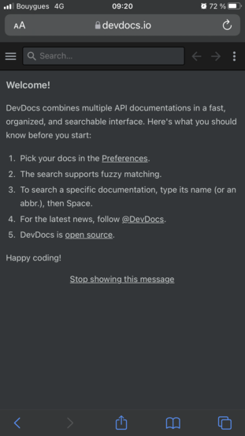
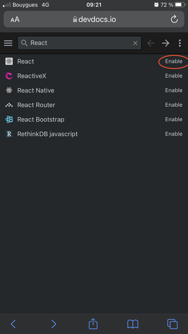
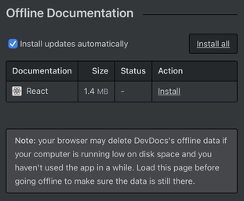

**Vous ne trouvez jamais le temps de parfaire vos connaissances sur les librairies que vous utilisez ?🧐**

**Grâce à [devdocs.io](https://devdocs.io/) et à la magie des [services workers](https://developer.mozilla.org/fr/docs/Web/API/Service_Worker_API), vous allez pouvoir mettre à profit les longs trajets sans connexions. 🚄🚄🚄**

## Comment accéder à de la documentation sans internet ? ##

- Allez sur [devdocs.io](https://devdocs.io/):

- Recherchez la documentation de votre choix:

- Cliquez sur les **bullets points** puis sur **Offline Data**

- Dans **Offline Documentation** cliquez sur **Install all**

**Voilà ! Vous pouvez désormais lire de la documentation sur DevDocs même sans internet 😬. (Désactivez vos données mobiles pour tester)**
